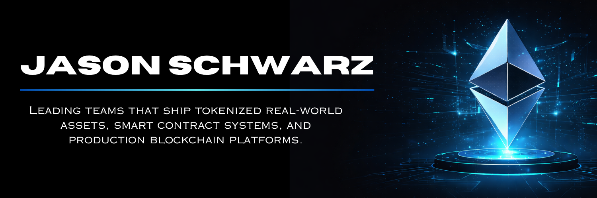

How do you take your coffee? Mine's black, no sugar. I've had a lot of it. Mostly while building things that probably shouldn't have worked but somehow did.

My first build wasn't a smart contract. It was a company. I was running a mechanical company, realized the industry had no decent tools, and built **Elements Software** from scratch. Province-wide adoption, regulatory approval, then COVID shut it all down. That taught me more than any job ever could.

At **LiveArt** I led smart contract architecture for 770K+ users and created the ART token. At **Primev** I built **Fast Protocol** from the ground up. But the work I'm most proud of is the developers I've mentored for 5+ years and **DefiKids**, a project I built so my friends' children could learn about crypto.

> If everyone is moving forward together, then success takes care of itself.  — Henry Ford

If any of that resonated, I'd love to grab a coffee and hear what you're working on. Virtual or in person, I'm always up for a good conversation. 

[jasonschwarz.xyz](https://jasonschwarz.xyz) 

---

  

<picture>
  <source media="(prefers-color-scheme: dark)" srcset="https://raw.githubusercontent.com/passandscore/passandscore/output/github-snake-dark.svg" />
  <source media="(prefers-color-scheme: light)" srcset="https://raw.githubusercontent.com/passandscore/passandscore/output/github-snake.svg" />
  
</picture>
